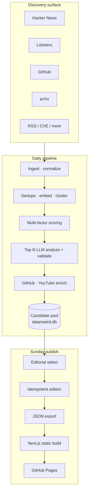
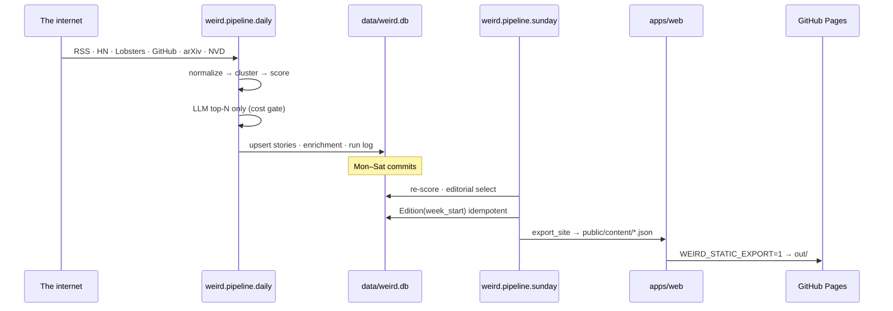
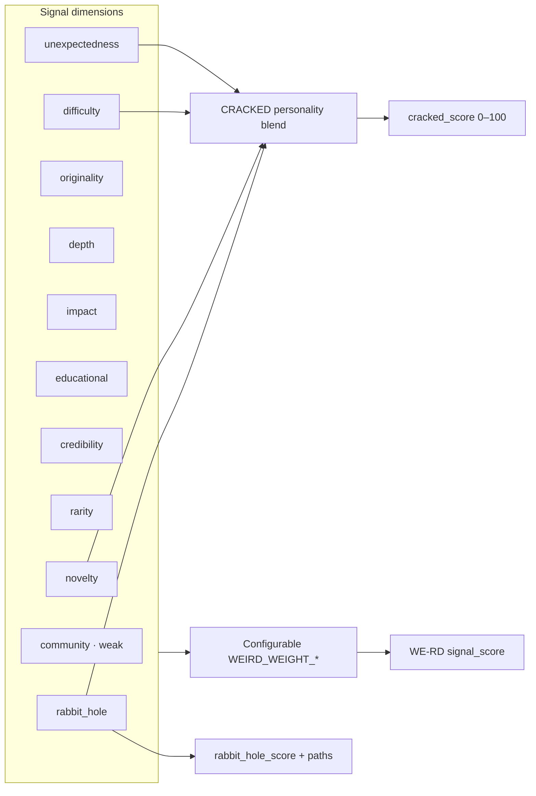
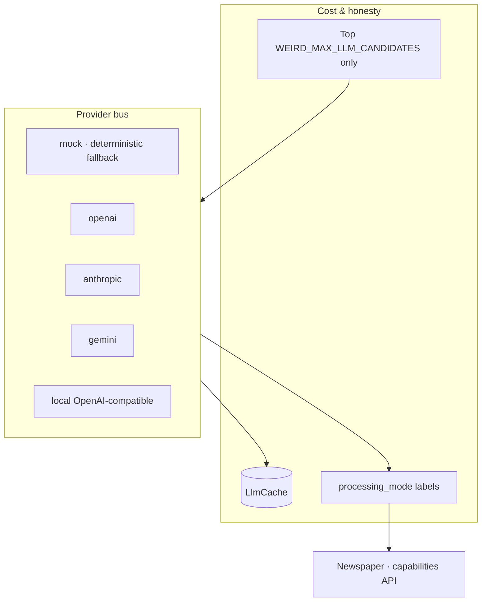
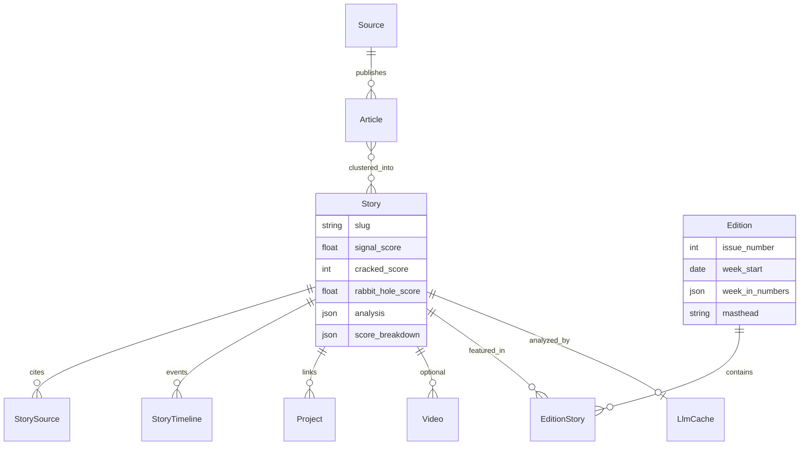
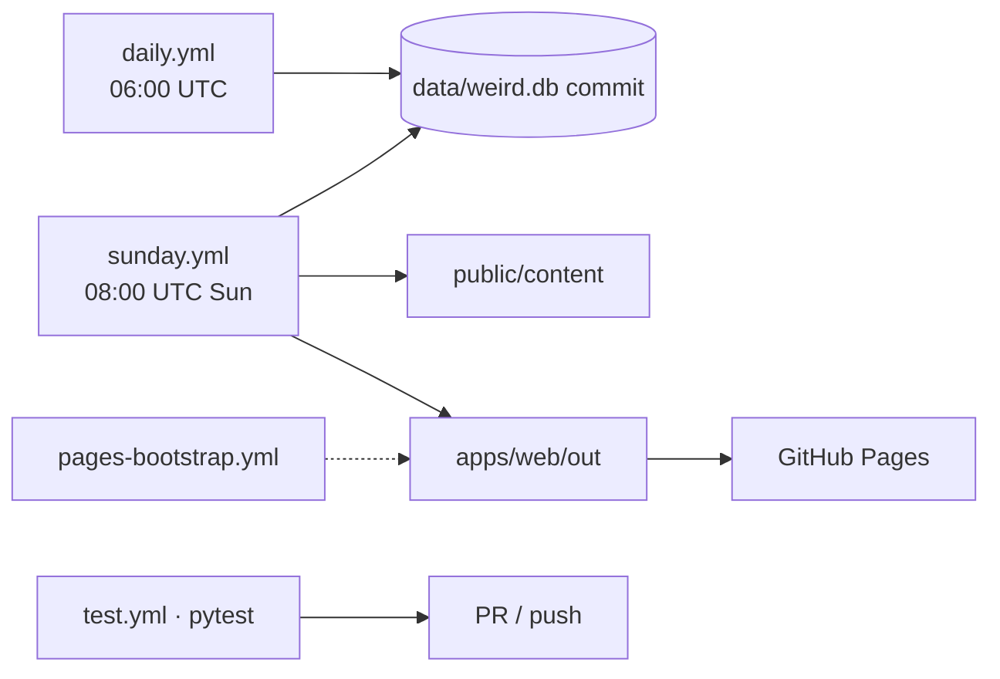

# WE-RD

### Things worth falling down a rabbit hole for.

**WE-RD** (pronounced *weird*) is an automated technical-curiosity newspaper. It discovers obscure, clever, and deeply engineered work across the internet, scores it for fascination — not popularity — and publishes a weekly broadsheet that answers three questions for every story:

1. *I didn't know this existed.*
2. *How did they actually build that?*
3. *Where is the source code?*

> Optimize for fascination — not article volume.

---

## What it is

| Not this | This |
| --- | --- |
| Generic tech aggregator | Fascination-first editorial machine |
| Headline summarizer | How-it-works + under-the-hood layers |
| One URL = one story | Multi-source clusters + timelines |
| Publish everything | Quality floors + category diversity |
| Opaque AI paste | Evidence extraction → claim validation |

Live paper (GitHub Pages): after Actions publish → `https://athul-s-369.github.io/WE-RD/`

---

## System overview



The repository itself is the durable notebook: daily Actions commit discoveries into `data/weird.db`; Sunday Actions cut an issue and deploy a static newspaper.

---

## Monorepo map

```text
WE-RD/
├── packages/core/weird/     # FastAPI · pipeline · scoring · LLM · DB
├── packages/prompts/        # Editable editorial prompts
├── apps/web/                # Next.js 15 newspaper (paper + static export)
├── data/weird.db            # GitHub-native SQLite corpus
├── database/migrations/     # Schema
├── .github/workflows/       # daily · sunday · pages-bootstrap · test
└── docs/                    # Deep dives (architecture, scoring, search…)
```

| Layer | Tech |
| --- | --- |
| Reader UI | Next.js 15, React, TypeScript, Tailwind — broadsheet + bento layout |
| Core | Python, FastAPI, SQLAlchemy, Pydantic |
| Corpus | SQLite (`data/weird.db`) committed by Actions; Postgres/pgvector optional |
| Intelligence | Pluggable LLM (`mock` · OpenAI · Anthropic · Gemini · local) |
| Publish | Static JSON under `apps/web/public/content/` → `out/` → Pages |

---

## Pipeline architecture



| Stage | Module | Role |
| --- | --- | --- |
| Ingest | `ingestion/*`, `catalog.py` | Source adapters → `NormalizedItem` |
| Process | `pipeline/process.py`, `clustering.py` | Embed, cluster, upsert `Story` |
| Score | `scoring.py` | WE-RD · CRACKED · rabbit-hole |
| Analyze | `pipeline/analyze.py`, `explore.py` | Bounded source dive + LLM facts/validate |
| Enrich | `enrichment/github.py`, `youtube.py` | Repos, stars, talks — never invent |
| Editorial | `pipeline/editorial.py` | Floors, diversity, featured pick |
| Publish | `pipeline/publish.py` | One edition per ISO `week_start` |
| Export | `pipeline/export_site.py` | Static content graph for Pages |

---

## Scoring model

Popularity is a **weak** signal. Interestingness is a weighted blend of technical dimensions:



| Meter | Meaning |
| --- | --- |
| **WE-RD score** | Serious multi-factor interestingness (`ScoreBreakdown` is explainable) |
| **CRACKED score** | Technical extremity / absurd ambition (UI meter + blurb) |
| **Rabbit-hole** | How many technical paths the story opens into source / concepts |

Security and leak status are labeled responsibly — status and context, not exploit recipes.

---

## Intelligence stack



- Missing API keys fall back to **mock** with an honest mode label — never fake “GPT said.”
- Prompts live as editable text: facts → analyze → validate → classify → editorial.
- Heuristic `analysis_fallback.py` keeps the paper usable with zero keys.
- Hybrid search: BM25-lite + hashed embeddings (always-on) or optional sentence-transformers / pgvector.
- Source graphs (`graph.py`) and bounded HTTP exploration (`explore.py`) deepen rabbit holes without becoming a crawler.

---

## Data model (core)



Week-in-numbers are **pipeline counts only** — never fabricated for drama.

---

## Reader surface

The frontend is a newspaper, not a SaaS dashboard: masthead, front-page lead, section bentos, cracked meters, and story-linked diagrams.

```text
apps/web/app/
  /                     Front page (edition.current)
  /issue/[n]            Archive issue
  /story/[slug]         Narrative + scores + source graph
  /story/[slug]/technical   Deeper how-it-works path
  /category/[slug]      Section rails
  /search               Client hybrid search (static-safe)
```

`lib/api.ts` dual-reads: live FastAPI in desk mode, or `public/content/*.json` when `WEIRD_STATIC_EXPORT=1` for Pages.

---

## Automation



| Workflow | Cadence | Effect |
| --- | --- | --- |
| `daily.yml` | Every day | Discover → score → enrich → commit corpus |
| `sunday.yml` | Sundays | Editorial cut → static build → deploy Pages |
| `pages-bootstrap.yml` | Manual | First seed + first deploy |
| `test.yml` | Push / PR | Pipeline · scoring · API · export suite |

---

## Design constraints (non-negotiable)

- **Fascination > volume** — quality floors beat fill quotas  
- **Evidence before eloquence** — validate claims; label confidence  
- **Rabbit holes over recaps** — source code, talks, related graphs  
- **Honest modes** — mock / fallback never masquerades as a paid model  
- **Repo-as-corpus** — the notebook survives without an always-on database  

---

## Documentation

| Doc | Topic |
| --- | --- |
| [Architecture](docs/architecture.md) | End-to-end system |
| [Ingestion](docs/ingestion.md) | Source adapters |
| [Editorial system](docs/editorial-system.md) | Selection & diversity |
| [Scoring](docs/scoring.md) | Weights & meters |
| [Semantic search](docs/semantic-search.md) | Hybrid retrieval |
| [Source exploration](docs/source-exploration.md) | Bounded fetch |
| [Provider architecture](docs/provider-architecture.md) | LLM bus |
| [GitHub Pages](docs/github-pages.md) | Publisher path |

---

## License

MIT — see [LICENSE](LICENSE).

PRs that improve discovery quality, factuality, or rabbit-hole paths beat UI chrome. Do not sensationalize security or leaks.
